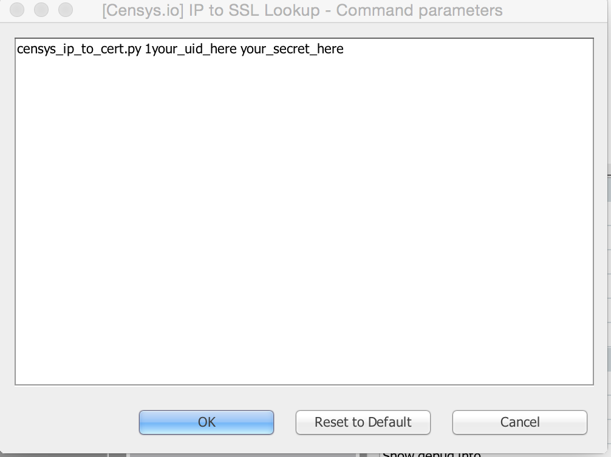

# maltego_censys
Basic Maltego Transforms for looking up SSL certs and IP info from censys.io

## Setup
* Clone this repo
* Import the censysio_sslcert_entity.mtz into Maltego
* Create the local transforms

## Sample Local Transforms Setup
Please note - if you have passive total transforms or any other transforms that are using a ssl certificate entity. For the SSL Cert to IP Lookup you will want the censys.io ssl certificate entity that was imported in the second step above.

###IP to SSL Lookup
* Transform Name: [Censys.io] IP to SSL Lookup
* Command: /usr/bin/python
* Parameters: censys_ip_to_cert.py your_censysio_api_uid your censyio_api_secret
* Working Directory: Path to where you cloned the Repo

###SSL Cert to IP Lookup
* Transform: [Censys.io] SSL Cert to IP
* Command: /usr/bin/python
* Parameters: censys_cert_to_ip.py your_censysio_api_uid your censyio_api_secret
* Working directory    Path to cloned Repo

If you can't fit your API UID and SECRET in easily when setting up the transform. You can click manage transforms, find
the transforms that you created above. Click the ... next to Command Parameters and type them in there. You should get something like this 
